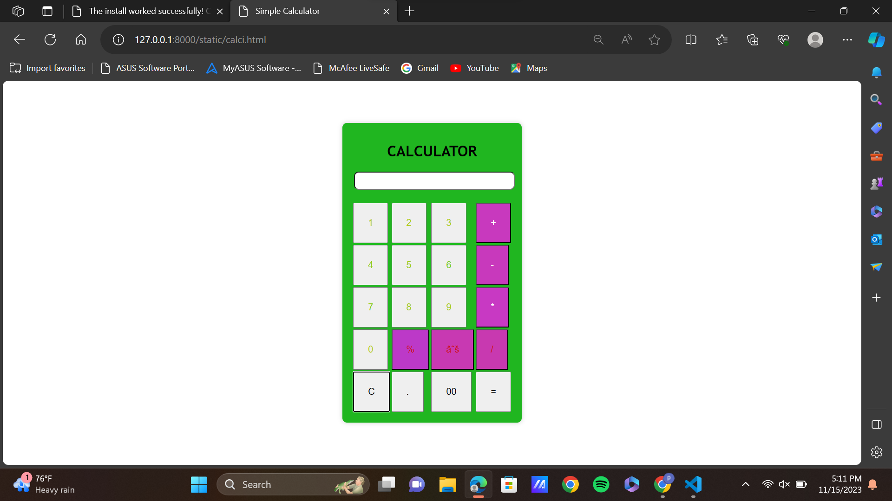
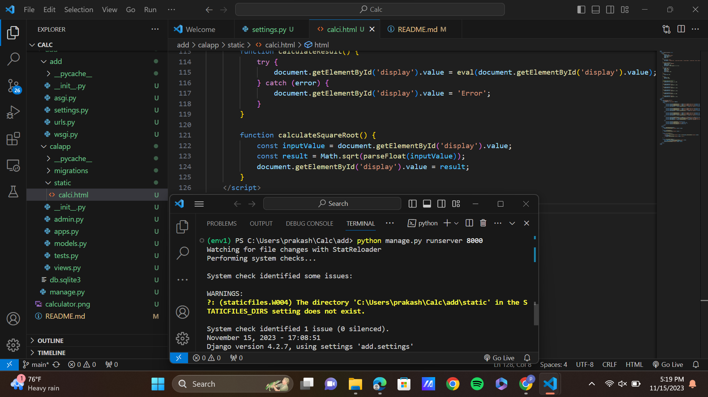

# Ex-08 Design of a Standard Calculator
## Date: 04/11/2023

## AIM:
To design a web application for a standard calculator with minimum five operations.

## DESIGN STEPS:

### Step 1:
Clone the github repository and create Django admin interface.

### Step 2:
Change settings.py file to allow request from all hosts.

### Step 3:
Use CSS for creating attractive colors.

### Step 4:
Write JavaScript program for implementing five different operations.

### Step 5:
Validate the HTML and CSS code.

### Step 6:
Publish the website in the given URL.

## PROGRAM :
```html
<html>
<head>
    <title>Simple Calculator</title>
    <style>
        body {
            display: flex;
            justify-content: center;
            align-items: center;
            height: 100vh;
            margin: 0;
        }
        h1{
            text-align: center;
            font-family: 'Trebuchet MS', 'Lucida Sans Unicode', 'Lucida Grande', 'Lucida Sans', Arial, sans-serif;
        }

        #calculator-container {
            background-color: #20b620;
            padding: 20px;
            border-radius: 10px;
            box-shadow: 0 0 10px rgba(0, 0, 0, 0.2);
        }

        input[type="text"] {
            width: 100%;
            padding: 10px;
            margin: 5px;
            color:black; 
            border-radius: 10px;
        }

        table {
            margin-top: 20px;
        }

        button {
            padding: 30px;
            font-size: 20px;
        }

        /* Define colors for operators */
        button[data-operator="+"] {
            background-color:rgb(200, 57, 190);
        }

        button[data-operator="-"] {
            background-color: rgb(200, 57, 188);
        }

        button[data-operator="*"] {
            background-color: rgb(200, 57, 195);
        }

        button[data-operator="/"] {
            background-color: rgb(200, 57, 176);
        }

        button[data-operator="%"] {
            background-color:rgb(188, 57, 200);
        }

        button[data-operator="sqrt"] {
            background-color: rgb(200, 57, 178);
        }
    </style>
</head>
<body>
    <div id="calculator-container">
        <h1>CALCULATOR</h1>
        <input type="text" id="display" readonly>
        <table>
            <tr>
                <td><button onclick="appendToDisplay('1')" style="color: rgb(182, 204, 17);">1</button></td>
                <td><button onclick="appendToDisplay('2')" style="color: rgb(176, 204, 17);">2</button></td>
                <td><button onclick="appendToDisplay('3')" style="color: rgb(176, 204, 17);">3</button></td>
                <td><button data-operator="+" onclick="appendToDisplay('+')" style="color: white;">+</button></td>
            </tr>
            <tr>
                <td><button onclick="appendToDisplay('4')" style="color: rgb(139, 204, 17);">4</button></td>
                <td><button onclick="appendToDisplay('5')" style="color: rgb(157, 204, 17);">5</button></td>
                <td><button onclick="appendToDisplay('6')" style="color: rgb(123, 204, 17);">6</button></td>
                <td><button data-operator="-" onclick="appendToDisplay('-')" style="color: white;">-</button></td>
            </tr>
            <tr>
                <td><button onclick="appendToDisplay('7')" style="color: rgb(132, 204, 17);">7</button></td>
                <td><button onclick="appendToDisplay('8')" style="color: rgb(163, 204, 17);">8</button></td>
                <td><button onclick="appendToDisplay('9')" style="color: rgb(170, 204, 17);">9</button></td>
                <td><button data-operator="*" onclick="appendToDisplay('*')" style="color: white;">*</button></td>
            </tr>
            <tr>
                <td><button onclick="appendToDisplay('0')" style="color: rgb(185, 204, 17);">0</button></td>
                <td><button data-operator="%" onclick="appendToDisplay('%')" style="color: rgb(204, 17, 17);">%</button></td>
                <td><button data-operator="sqrt" onclick="calculateSquareRoot()" style="color: rgb(204, 17, 17);">√</button></td>
                <td><button data-operator="/" onclick="appendToDisplay('/')" style="color: rgb(204, 17, 17);">/</button></td>
            </tr>
            <tr>
                <td><button onclick="clearDisplay()">C</button></td>
                <td><button onclick="appendToDisplay('.')">.</button></td>
                <td><button onclick="appendToDisplay('00')">00</button></td>
                <td><button onclick="calculateResult()">=</button></td>
            </tr>
        </table>
    </div>
    <script>
        function appendToDisplay(value) {
            document.getElementById('display').value += value;
        }

        function clearDisplay() {
            document.getElementById('display').value = '';
        }

        function calculateResult() {
            try {
                document.getElementById('display').value = eval(document.getElementById('display').value);
            } catch (error) {
                document.getElementById('display').value = 'Error';
            }
        }

        function calculateSquareRoot() {
            const inputValue = document.getElementById('display').value;
            const result = Math.sqrt(parseFloat(inputValue));
            document.getElementById('display').value = result;
        }
    </script>
</body>
</html>
```
## OUTPUT:



## RESULT:
The program for designing a standard calculator using HTML and CSS is executed successfully.
